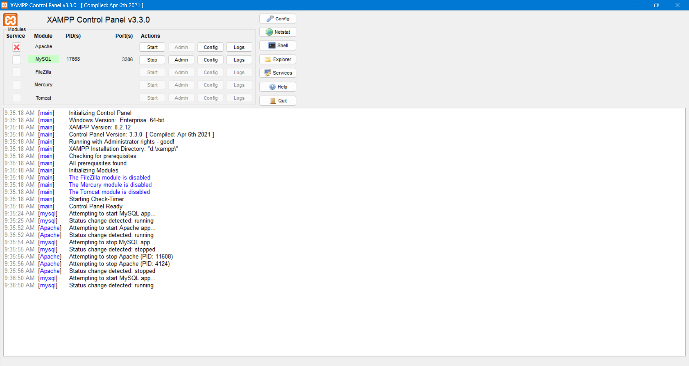
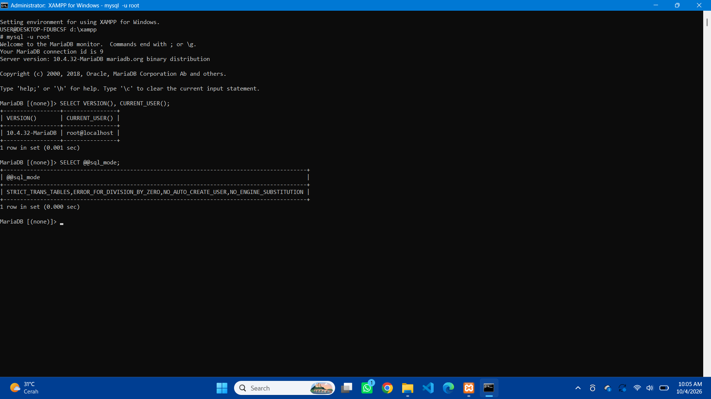
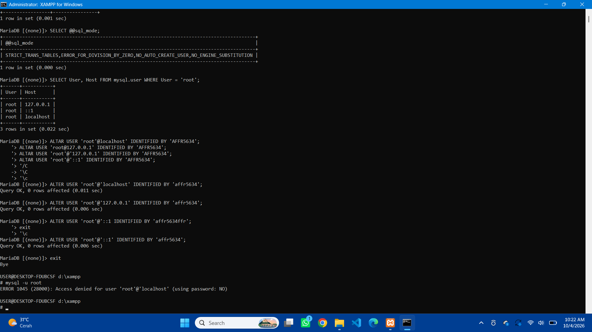
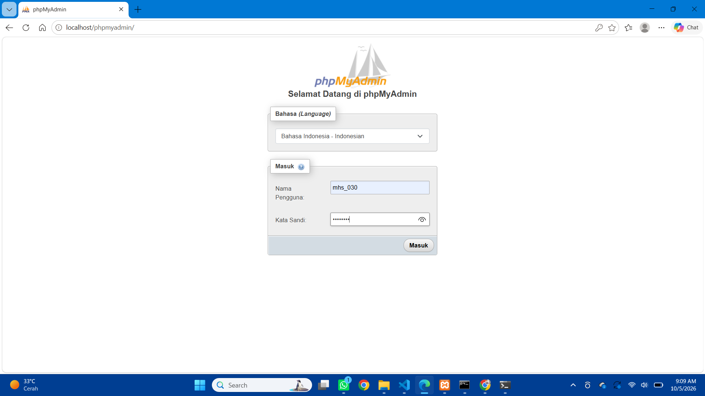
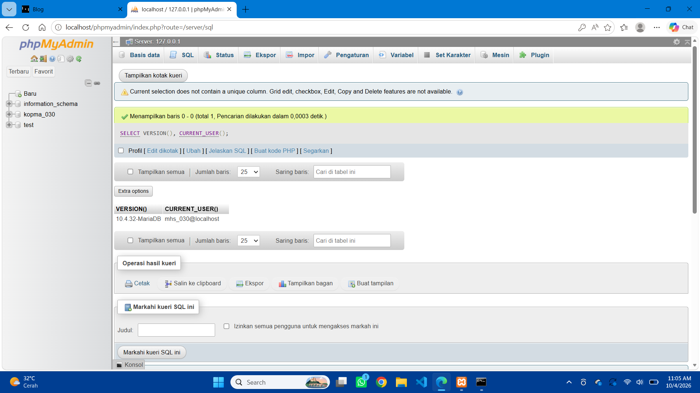
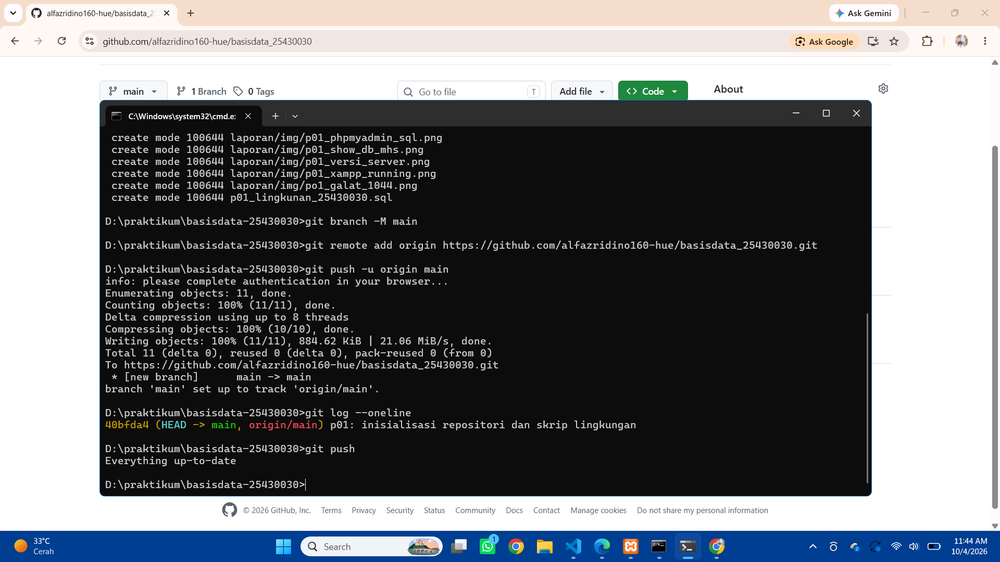
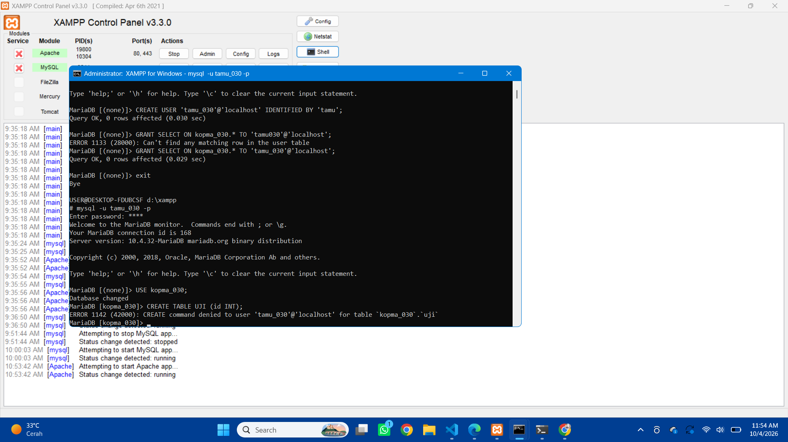
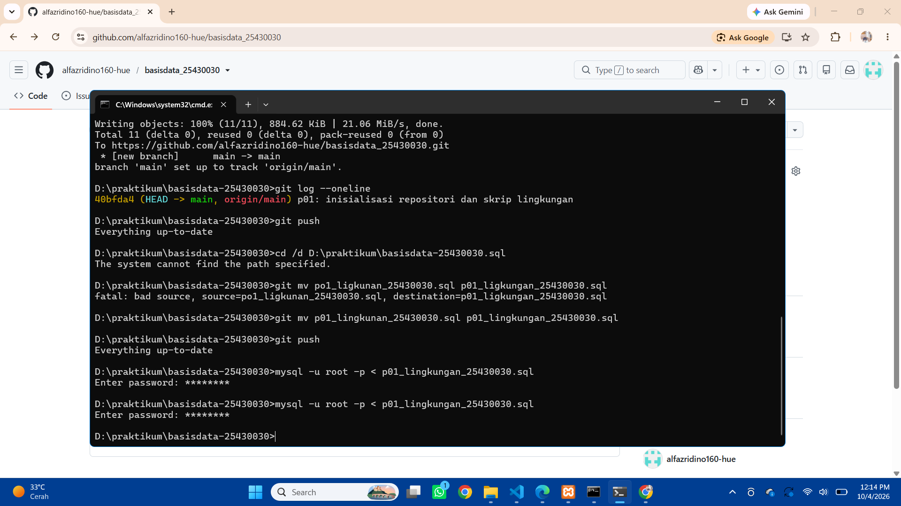
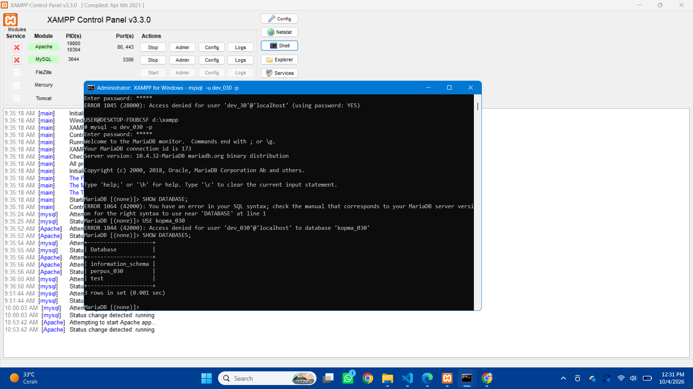

<!--
PANDUAN (hapus komentar ini sebelum commit):
- Bagian bertanda [TULIS ...] wajib kamu isi sendiri dengan bahasamu.
- Bagian "arah jawaban" hanya petunjuk. Tulis ulang, jangan disalin mentah-mentah.
- Pastikan semua gambar ada di laporan/img/ dengan nama yang sama persis
  (huruf besar-kecil dihitung oleh GitHub).
- Jangan menulis password asli di mana pun.
-->

# Laporan Praktikum Basis Data - Pertemuan 01

**Nama:** Alfazri Fadino Rizco    **NPM:** 25430030    **Kelas:** B    **Tanggal:** 04-10-2026

**Asisten/Dosen:** Dedi Irawan S.Kom, M.Kom

## 1. Tujuan Praktikum

tujuan praktikum modul 1 ini adalah untuk menjalankan dan menghentikan sever MariaDB menggunakan XAMPP control serta membaca status dan portnya. terhubung ke server melalui CLI dan phpMyAdmin, membuat akun root dan mengamankannya dengan password, membuat akun kerja yang mempunyai hak terbatas. membuat sebuah basisdata yang ke repositori git yang terhubung ke github langsung.

## 2. Ringkasan Dasar Teori

MariaDB bekerja dengan dengan model klien-server. klien memberi perintah sedangkan server menyimpan data dan menunggu perintah dari klien, phpMyAdmin dan mysql bertindak sebagai klien mengirim perintah sql, lalu menunggu dan menampilkan pesat galat yang dikirm oleh server. pada akun MariaDB ada beberapa akun yang di kenakan hak minimum, contohnya yang ku lakukan pada akun mhs_030, tamu_030, dan dev_030 pada akun terebut sudah diberi hak yang terbatas, dimana akun tersebut hanya bisa mengakses datanya saja dan tidak bisa mengedit data tersebut, itulah yg di namakan hak akses minimum.

## 3. Hasil Langkah Percobaan

**D.1 Menjalankan MariaDB.** menjalankan server MariaDB di xampp



**D.2 Masuk lewat CLI dan memeriksa versi.**

```sql
SELECT VERSION(), CURRENT_USER();
SHOW DATABASES;
SELECT @@sql_mode;
```



**D.3 Mengamankan akun root.** Ketiga akun root (`localhost`, `127.0.0.1`, `::1`) diberi password.

```sql
ALTER USER 'root'@'localhost' IDENTIFIED BY '<afr5634>';
ALTER USER 'root'@'127.0.0.1' IDENTIFIED BY '<affr5634>';
ALTER USER 'root'@'::1' IDENTIFIED BY '<affr5634>';
```



**D.4 Membuat basis data dan akun kerja.**

```sql
CREATE DATABASE kopma_030 CHARACTER SET utf8mb4 COLLATE utf8mb4_unicode_ci;
CREATE USER 'mhs_030'@'localhost' IDENTIFIED BY '<password_kerja>';
GRANT ALL PRIVILEGES ON kopma_030.* TO 'mhs_030'@'localhost';
SHOW GRANTS FOR 'mhs_030'@'localhost';
```


**D.5 phpMyAdmin mode cookie.** Nilai `auth_type` di `config.inc.php` diubah menjadi `'cookie'`.





**D.6 Repositori Git dan push pertama.**



## 4. Jawaban Titik Analisis

**Titik Analisis 1 - Label "MySQL" padahal yang berjalan MariaDB**

MariaDB addlaah turunan mysql sehingga sintaks dasarnya umumnya sama saja. tetapi hal yang bergantung pada versi haarus di rujuk ke dokumentasi MariaDB sesuai versi yang terpasang. cara mengecek versi nya adalah SELECT VERSION().

**Titik Analisis 2 - Masuk tanpa `-p`**

Pesan galat yang muncul:

```text
ERROR 1045 (28000): Access denied for user 'root'@'localhost' (using password: NO)
```


**Titik Analisis 3 - `information_schema` terlihat, `mysql` ditolak**

information_schema adalah berisisi data yang dapat dilihat setiap akun, sedangkan mysql tidak menyimpan data sensitif maka tidak semua akun dapat melihatnya.

**Titik Analisis 4 - Mode `cookie` vs `config`**

mode cookie cenderung lebih aman di banding mode cookie, dikarenakan mode config memiliki sedikit atau mungkin hampir tidak ada keamanan sedangkan mode cookie dia lebih aman di banding mode config, siapapun yamng membuka phpmyadmin di mode config dia langsung masuk begitu saja sedagkan mode cookie perlu memasukkan user dan juga passssword.

## 5. Hasil Latihan dan Modifikasi

**Latihan 1 - Akun `tamu_030` dengan hak SELECT saja**

```sql
CREATE USER 'tamu_030'@'localhost' IDENTIFIED BY '<password_tamu>';
GRANT SELECT ON kopma_030.* TO 'tamu_030'@'localhost';
```

Masuk sebagai `tamu_030`, lalu:

```sql
USE kopma_030;
CREATE TABLE uji (id INT);
```



ketika sudah login menggunakan akn tamu_030 saya mampu melihat basis data yang ada tetapi akun tidak punya hak untuk CREATE.

**Latihan 2 - Skrip yang bisa dijalankan berulang**

```sql
-- p01_lingkungan_25430030.sql
-- Password sengaja diganti penanda. JANGAN commit password asli.
CREATE DATABASE IF NOT EXISTS kopma_030
  CHARACTER SET utf8mb4 COLLATE utf8mb4_unicode_ci;
CREATE USER IF NOT EXISTS 'mhs_030'@'localhost' IDENTIFIED BY '<password_kerja>';
GRANT ALL PRIVILEGES ON kopma_030.* TO 'mhs_030'@'localhost';
```

Dijalankan dua kali dengan:

```bash
mysql -u root -p < p01_lingkungan_25430030.sql
```



alasan menggunakan IF NOT EXISTS itu membuat skrip aman di ulag adalah server memerikssa dulu dan melewati perintah yang objeknya sudah ada.

## 6. Tugas Mandiri: Milestone Proyek 1

| Butir | Hasil |
|---|---|
| Tema proyek | Perpustakaan |
| Basis data proyek | `perpus_030` (utf8mb4) |
| Akun proyek | `dev_030`, hanya berhak atas `perpus_030` |
| Organisasi fiktif | [perpustakaan cendikia AFR] |
| Berkas | `README.md` (perpustakaan), `.gitignore` |

```sql
CREATE DATABASE perpus_030 CHARACTER SET utf8mb4 COLLATE utf8mb4_unicode_ci;
CREATE USER 'dev_030'@'localhost' IDENTIFIED BY '<password_dev>';
GRANT ALL PRIVILEGES ON perpus_030.* TO 'dev_030'@'localhost';
```




Isi `.gitignore`:

```text
*.env
kredensial*.txt
```


## 7. Pembahasan dan Kendala

**Kendala 1: `sql_mode` tidak memuat `STRICT_TRANS_TABLES`.** kendala sql_mode tidak memuat dikarenakan sql_mode itu ada dua baris di my.ini dan aku lalu menambahkan tagar ke satunya. setelah itu di cek ulang dan berhasil

**Kendala 2: salah ketik pada perintah SQL.** jika aku salah ketik maka akan mucul seperti ini (ERROR 1064 (42000): You have an error in your SQL syntax; check the manual that corresponds to your MariaDB server version for the right syntax to use near 'CRETAE USER 'dev_030'@'localhost' IDENTIFIED BY 'dev30'' at line 1)


## 8. Kesimpulan

pada modul 1 ini kita sebagai mahasiswa di ajarkan untuk menghidupkan dan menghentikan server MariaDB.

## 9. Pernyataan Penggunaan AI

saya menggunakan ai untuk membantu membuat kerangka laporan

## 10. Bukti Git

- Repositori: https://github.com/alfazridino160-hue/basisdata-25430030
- Hash commit: `[34e0cb7 --oneline]`
- Pesan commit: `p01: milestone proyek 1`
