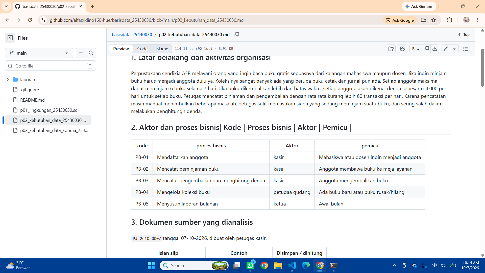
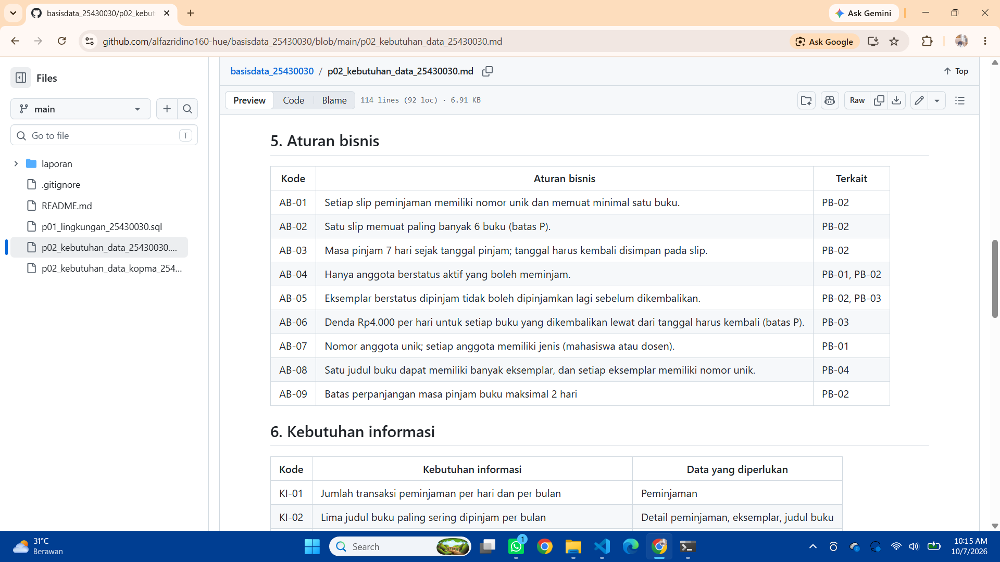
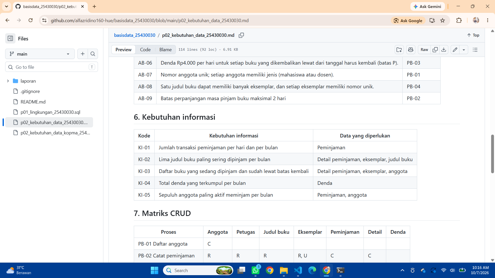
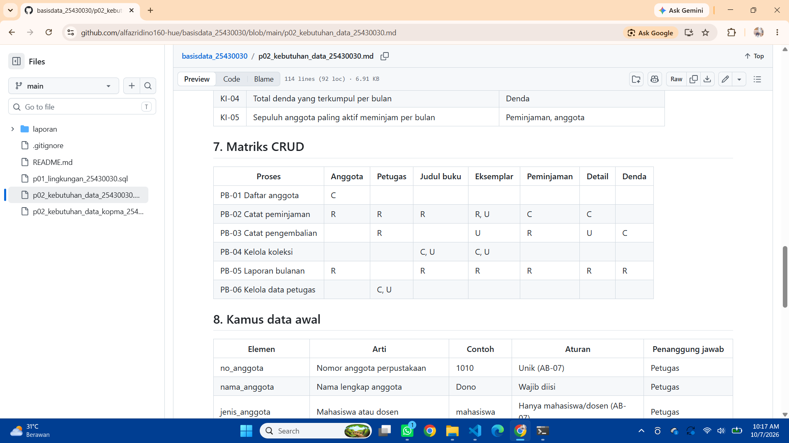
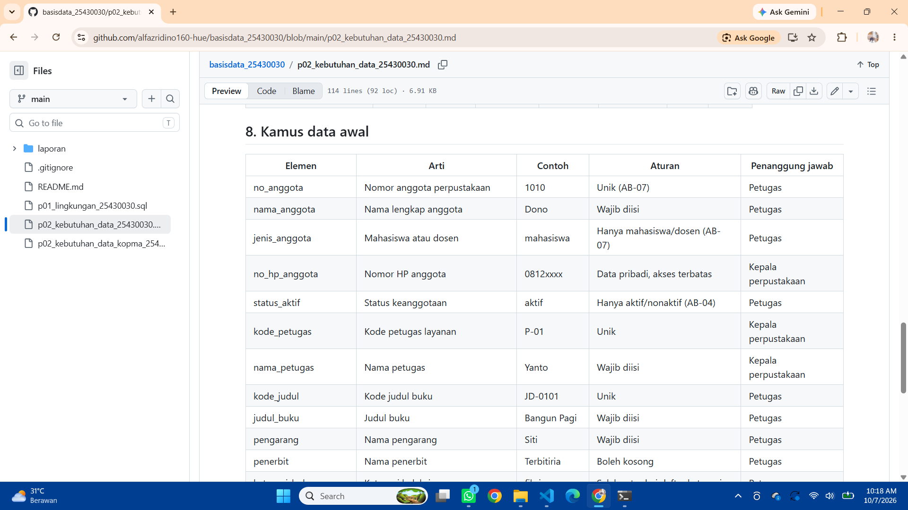
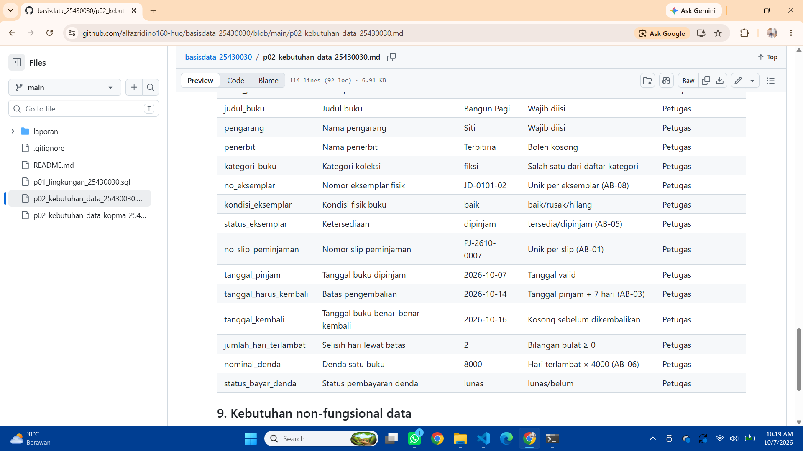

# Laporan Praktikum Basis Data - Pertemuan 02

**Nama:** Alfazri Fadino Rizco    **NPM:** 25430030    **Kelas:** B    **Tanggal:** 07-10-2026

**Asisten/Dosen:** Dedi Irawan S.Kom, M.Kom

## 1. Tujuan Praktikum

menganalisis kebutuhan data dari studi kasus kopma, mengidentifikasi aktivitas organisasi , aktor , dari narasi wawancara, dan sumber dokumen. menganalis proses bisnis seperti, mengelola data pemasok, mendaftarkan anggota dll. menganalisis aturan bisnis, kamus data, kebutuhan informasi, matriks CRUD, lalu menerapkannya pad proyek perpustakaan. 

## 2. Ringkasan Dasar Teori

Menganalisis kebutuan data untuk proses bisnis
- proses bisnis dan aktor mempunyai hubungan yang erat karen keduanya saling berkaitan dan contohnya sudah banyak di cerita organisasi.
- aturan bisnis di buat agar lebih mudah mengatur suatu peminjaman buku misalnya pada tema perpustakaan.
- matriks CRUD adalah tabel yang menunjukkan proses mana melakukan apa terhadap data mana.

## 3. Hasil Langkah Percobaan

**D.1 Studi kasus Kopma.** Perpustakaan cendikia AFR melayani orang yang ingin baca buku gratis sepuasnya dari kalangan mahasiswa maupun dosen. jika ingin minjam buku harus menjadi anggota dulu ya. koleksinya sangat banyak ada yang berupa buku cetak dan jurnal pun ada. pada saat wawancara:ketua: harga barang sering naik, jadi kami bingung saat melihat nota lama, petugas gudang: kadang di buku catatan stoknya malah minus ,kasir: anggota sering lupa membawa kartu, jadi kami mencarinya lewat NIM.

**D.2 Aktor dan proses bisnis.** cara menemukan proses yg ada adalah dengan cara melihat kata kerjanya aku menemukan 5 proses bisnis.

**D.3 Membedah nota penjualan.** [TULIS: isian mana yang disimpan dan mana yang dihitung, dengan contoh nota `PJ-2609-0142`.]

**D.4 Entitas kandidat dan aturan bisnis.** entitas kandidat contonya angoota, ketua dll, sedangkan  contoh aturan, Setiap slip peminjaman memiliki nomor unik dan memuat minimal satu buku.

**D.5 Kebutuhan informasi dan matriks CRUD.** kebutuhan informasi misalnya data pengembalian dan peminjaman, matriks CRUD adalah tabel yang menunjukkan proses mana melakukan apa terhadap data mana.

**D.6 dan D.7 Kamus data dan dokumen Kopma.** Dokumen kebutuhan data Kopma ditulis di `p02_kebutuhan_data_kopma_25430030.md` dan di-commit dengan pesan `p02: dokumen kebutuhan data kopma`.

## 4. Jawaban Titik Analisis

**Titik Analisis 1 - Mengapa nota menyimpan harga saat transaksi?**

Nota perlu menyimpan data saat transaksi karena harga barang bisa berubah kapan pun.

**Titik Analisis 2 - Subtotal dan total sebagai nilai turunan**

subtotal dan total sebaiknya tidak di simpan karena bisa jadi nanti tidak cocok, namun total tetap di simpan karena total lama dapat di hitung juga.

**Titik Analisis 3 - Kolom Pemasok tanpa huruf C**

pada kolom pemasok tidak ada huruf c, artinya tidak ada proses yang membuat data pemasok, padahal bisa membacanya. karena itu perlu di tambahkan  proses untuk mengelola data pemasok yang di lakukan oleh petugas gudang.

## 5. Hasil Latihan dan Modifikasi

**Latihan 1 - Poin loyalitas Kopma**

 contoh perhitungan: nota Rp27.550 menghasilkan 2 poin tiap Rp.10.0000 menghasilkan 1 poin

**Latihan 2 - Tiga pernyataan kebutuhan kabur diperbaiki**

| Pernyataan kabur | Pernyataan teruji |
|---|---|
| Data anggota harus aman | nomor HP, NIM Anggota dll hanya bisa di buka oleh ketua untuk kebutuhan tertentu |
| Sistem harus cepat mencari barang | minimal 2 detik harus ketemu |
| Laporan stok harus akurat | minimal 2 selisinya |

## 6. Tugas Mandiri: Milestone Proyek 2

**Perhitungan parameter P**

- Dua digit terakhir NPM: 30
- 30 mod 9 = 3, sehingga P = 3 + 1 = **4**

| Parameter | Rumus | Nilai |
|---|---|---|
| Batas item per transaksi | P + 2 | 6 buku |
| Denda harian | P ribu rupiah | Rp4.000 per hari |
| Volume transaksi harian | 40 + 5 x P | 60 |

**Ringkasan dokumen proyek** (`p02_kebutuhan_data_25430030.md`, organisasi Perpustakaan Cendekia AFR)

| Butir | Minimum | Hasilku |
|---|---|---|
| Proses bisnis | 4 | 5 |
| Entitas kandidat | 6 | 7 |
| Aturan bisnis | 8 | 9 |
| Kebutuhan informasi | 5 | 5 |
| Elemen kamus data | 20 | 22 |
| Dokumen sumber fiktif | 1 | 1 |

**Bukti tampilan GitHub**

## 7. Pembahasan dan Kendala

**Kendala 1: konflik penggabungan pada README.md.** push di tolak lalu aku meminta bantuan AI dan berhasil push, penyebabnya aku salah memasukkan README dan ku edit di github 

**Kendala 2: kesalahan pada perintah commit.** salah menaruh tanda kutip 2

## 8. Kesimpulan

Menganalisis kebutuhan data dari studi kasus kopma, mengidentifikasi aktivitas organisasi , aktor , dari narasi wawancara, dan sumber dokumen. menganalis proses bisnis seperti, mengelola data pemasok, mendaftarkan anggota dll. menganalisis aturan bisnis, kamus data, kebutuhan informasi, matriks CRUD, lalu menerapkannya pad proyek perpustakaan. 

## 9. Pernyataan Penggunaan AI

- Menggunakan claude AI untuk membuat kerangka laporan dan membantu beberapa isi laporan.

## 10. Bukti Git

- Repositori:https://github.com/alfazridino160-hue/basisdata_25430030/blob/main/p02_kebutuhan_data_25430030.md
- Hash commit dokumen Kopma: `07a4e43`
- Hash commit milestone: `34e0cb7`
- Pesan commit: `p02: dokumen kebutuhan data kopma` dan `p02: milestone proyek 2`

## Checklist

**Checklist umum**

- [ ] Identitas lengkap (nama, NPM, kelas, pertemuan, tanggal, asisten/dosen)
- [ ] Tujuan ditulis dengan bahasa sendiri (maks. 5 baris)
- [ ] Ringkasan teori maks. setengah halaman, tanpa menyalin buku
- [ ] Tangkapan layar langkah kunci disertai keterangan
- [ ] Semua Titik Analisis dijawab dengan alasan
- [ ] Latihan (E) disertai bukti
- [ ] Tugas Mandiri (F) berisi berkas, bukti, dan penjelasan desain
- [ ] Pembahasan memuat kendala, cara membaca galat, dan cara mengatasi
- [ ] Kesimpulan 2-4 kalimat
- [ ] Pernyataan penggunaan AI
- [ ] Bukti Git (tautan repositori + hash commit)
- [ ] Keaslian: tangkapan layar menampilkan akun dan jam sistem

**Checklist khusus Pertemuan 2**

- [ ] `p02_kebutuhan_data_kopma_25430030.md` dan `p02_kebutuhan_data_25430030.md`
- [ ] Tabel PB, AB, KI, matriks CRUD, dan kamus data di berkas proyek (tangkapan tampilan GitHub)
- [ ] Titik Analisis 1-3, perhitungan parameter P, dan perbaikan tiga pernyataan kebutuhan kabur
